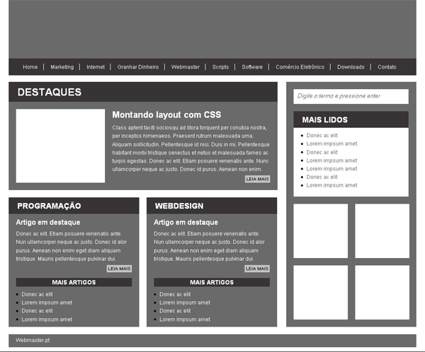

# Exercício de <abbr title="HyperText Markup Language 5">HTML5</abbr>

Exercício criado em base do repositório [exercicios-front-End](https://github.com/iamfelipemattos/exercicios-front-End), de [iamfelipemattos](https://github.com/iamfelipemattos/), de 22/02/2014. Exercício utilizado no curso [Desenvolvimento de Aplicativos para Móbile](https://www.cadmaxcursos.com.br/aplicativos), da [Cadmax](https://www.cadmaxcursos.com.br/), Caxias do Sul, <abbr title="Rio Grande do Sul">RS</abbr>.

O exercício que você deverá fazer é o seguinte:

Construir o HTML do [mockup.jpg](mockup.jpg) disponível aqui abaixo, também nesse repositório e/ou [neste endereço](http://www.webmaster.pt/wp-content/uploads/2010/02/layout.jpg). O exercício consiste no desenvolvimento **APENAS** do HTML (**NÃO** deverá ser escrito nada do <abbr title="Cascading Style Sheets">CSS</abbr> no momento).

Dica: para maior visualização do mockup, utilize como referência a imagem em 200% do seu tamanho original.

Os seguintes pré-requisitos deverão ser atendidos:

* O markup deverá ser um **HTML5 válido**, de acordo com o serviço [Markup Validation Service](https://validator.w3.org/), do [W3C](http://www.w3c.br/Home/WebHome);
* **No mínimo**, as seguintes tags deverão ser utilizadas corretamente, aonde convir:
  * `<html>`, `<head>`, `<meta>`, `<body>`, `<header>`, `<nav>`, `<ul>`, `<li>`, `<a>`, `<main>`, `<section>`, `<h1>`, ``, `<h2>`, `
`, `<aside>`, `<form>`, `<input>`, `<ol>`, `<footer>` e `<address>` - <abbr title="Observação">obs.</abbr>: o uso da tag `<article>` é opcional e passível de interpretação.
* Todo exercício deverá ser reproduzido em um **NOVO** repositório criado no [GitHub](https://github.com/) de seu usuário;
* Espera-se **no mínimo** um commit para cada `<header>`, `<section>`, `<aside>` e `<footer>` concluída, conforme você aprendeu a utilizar Git. Lembre-se de baixar, instalar e configurar o [Git](https://git-scm.com/). Lembre-se também de fazer tudo de forma sequencial e em pequenas partes enquanto estiver escrevendo os HTMLs;
* Para os espaços que preveem o uso de imagens, você pode usar serviços como o [lorempixel](http://lorempixel.com/), [Placeholder.com](https://placeholder.com/) ou outros. Os locais que terão imagem serão: 1. o quadrado branco de "Destaques"; 2. os quadrados brancos abaixo da seção "Mais Lidos", na coluna à direita;
* O conteúdo não necessariamente precisa ser o mesmo, mas semelhante em tamanho e/ou quantidade. Você pode utilizar serviços como o [Lorem Ipsum](https://www.lipsum.com/) ou até mesmo outros como o [Samuel L. Ipsum](http://slipsum.com/). Divirta-se;
* Deverá ser criado também pelo menos **uma página interna**, pro link do artigo contido em "Destaques" - não esqueça de linká-la. Você também poderá linkar o link "Home" do `<header>` para a primeira página e/ou página inicial. Essa página interna deverá ter o mesmo `<header>`, `<footer>` e `<aside>` já criados, porém com o conteúdo diferente em `<main>`. Nesse caso pode ser utilizada `<article>`, embora a documentação do HTML5 mencione que há casos que pode ser redundante.

Em caso de dúvidas de HTML, você pode utilizar quaisquer um dos materiais já fornecidos em aula, além de sites como:

* [W3C cheatsheet](https://www.w3.org/2009/cheatsheet/);
* [DevDocs API Documentation > HTML](http://devdocs.io/html/);
* [MDN web docs > HTML5](https://developer.mozilla.org/pt-BR/docs/Web/HTML/HTML5).

Em caso de dúvidas com Git, você poderá também consultar os materiais já fornecidos e/ou também os links abaixo:

* [Documentação oficial do Git](https://git-scm.com/doc);
* [Manual de referência oficial do Git](https://git-scm.com/docs);
* [O GitHub Git Cheat Sheet](https://services.github.com/on-demand/downloads/github-git-cheat-sheet.pdf).

Um bom exercício para você!

## Colaboradores

* [Anderson Nascimento](http://www.andersonn.com.br);
* [Giovanni Pires da Silva](https://github.com/giovannipds).
